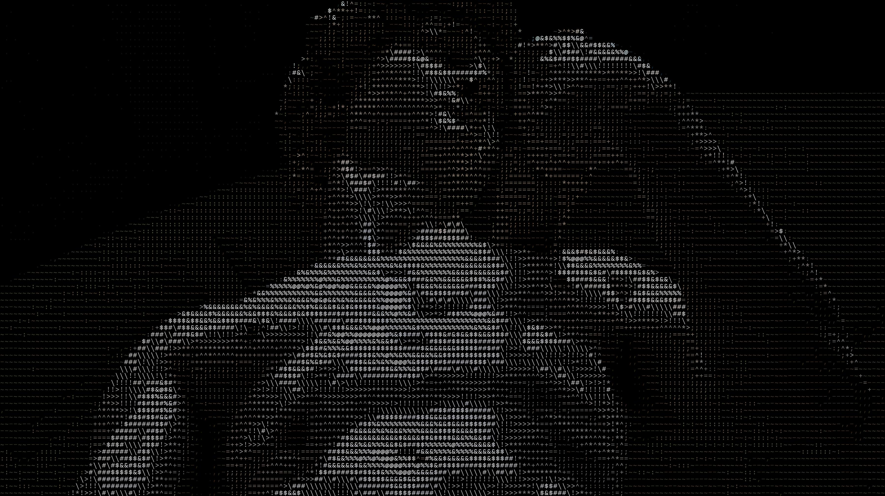
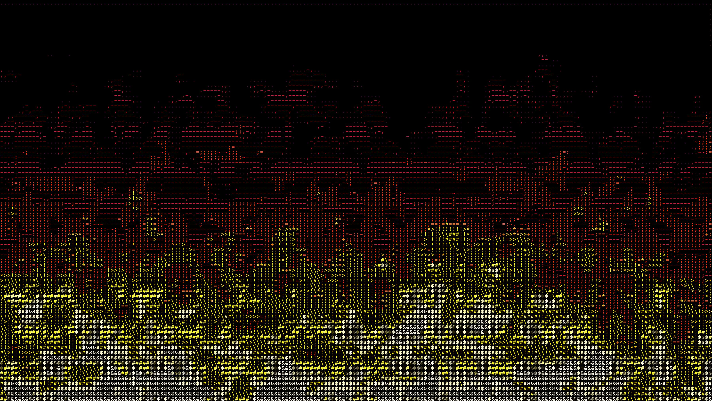
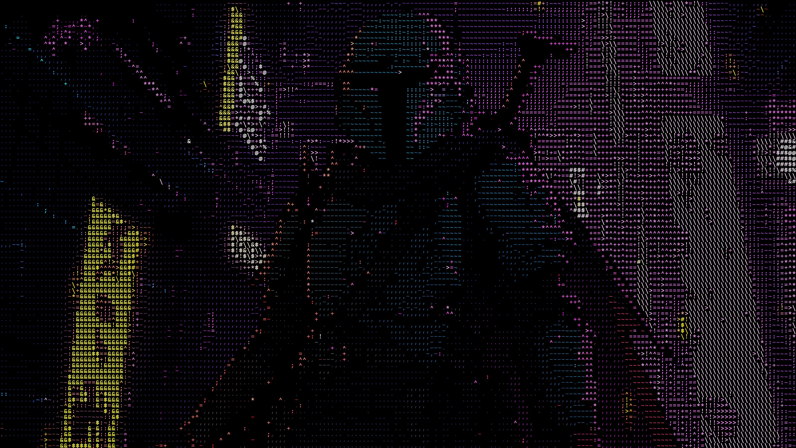

```
       _____    _________________ .___.___                                              
      /  _  \  /   _____\_   ___ \|   |   |                                             
     /  /_\  \ \_____  \/    \  \/|   |   |                                             
    /    |    \/        \     \___|   |   |                                             
    \____|__  /_______  /\______  |___|___|                                             
            \/        \/        \/                                                      
       _____          __    ________                                   __               
      /  _  \________/  |_ /  _____/  ____   ____   ________________ _/  |_ ___________ 
     /  /_\  \_  __ \   __/   \  ____/ __ \ /    \_/ __ \_  __ \__  \\   __/  _ \_  __ \
    /    |    |  | \/|  | \    \_\  \  ___/|   |  \  ___/|  | \// __ \|  |(  <_> |  | \/
    \____|__  |__|   |__|  \______  /\___  |___|  /\___  |__|  (____  |__| \____/|__|   
            \/                    \/     \/     \/     \/           \/                  
    Made with <3 by - https://prathmesh-ka-github.github.io/pratham-c0des./

```               

### 👩🏻‍💻 A simple, lightweight and blazingly fast ASCII Art Generator that converts images into text-based artwork using ASCII characters. A fun and creative way to visualize images with code!

This is a CLI program. Requires Python and PiP.

## Few examples -

[Base Image](https://github.com/prathmesh-ka-github/ASCII-ArtGenerator/blob/main/david2.jpeg) | Original Image from - [Michelangelo: The David](http://www.christheguide.com/2012/04/michelangelo-david.html)


[Base Image](https://github.com/prathmesh-ka-github/ASCII-ArtGenerator/blob/main/david.jpeg) | Original Image from -[Michelangelo's David: Admire World's Greatest Sculpture at Accademia Gallery](https://www.accademia.org/explore-museum/artworks/michelangelos-david/)


[Base Image](https://github.com/prathmesh-ka-github/ASCII-ArtGenerator/blob/main/david3.jpeg) | Original Image from - [Michelangelo's David: 7 facts you might not know | Visit Tuscany](https://www.visittuscany.com/en/ideas/michelangelos-david-some-facts-you-might-not-know/)


## 📦 Libraries 

### [1. Pillow 11.3.0 - Python Imaging Library](https://pillow.readthedocs.io/en/stable/)

The Python Imaging Library adds image processing capabilities to your Python interpreter. This library provides extensive file format support, an efficient internal representation, and fairly powerful image processing capabilities.

The core image library is designed for fast access to data stored in a few basic pixel formats. It should provide a solid foundation for a general image processing tool.

Check python support for Pillow to check compatibility of Pillow with your system. https://pillow.readthedocs.io/en/stable/installation/platform-support.html

## 📄 Installation Intructions -

Make sure you have - 
- python
- pip

<br>

Follow these instruction to install and run it on your machine!

1. Setup the virtual enviornment ``` > python -m venv .venv```

1. Activate the virtual environment ```> .\.venv\Scripts\activate```

1. Install required packages ```> python pip install -r ./requirements.txt ```

That's it! Done!

NOTE:  Use ```pip3``` or ```python3``` if you have Python3.*

## 🏃🏻‍♂️ Running the app

Use the command - ```> python main.py galaxy.jpg stdout``` to run the application and generate a default ascii art.

you will get this as the output -


### Command Usage -
```> python main.py <input_image> <output_type>```

1. ```<input_image>``` means the path to your input image. Make sure to add the file extension too.

1. ```<output_type>``` means the type of output you want. Output types are -
    - ```-``` or ```stdout``` Command line output. This will print the ascii art directly to the command line. (Command line output produces a low resolution output. We recommend ```img``` output type to get good quality ascii art).
    - ```txt```- Text output. The app will generate a ascii_art.txt.
    - ```img```- Image output. The app will generate a ascii_image.jpg.

<b>⚠ NOTE</b>: Don't worry if you mess up any commands. The CLI instructions will guide you.

## ⚙ Configuration

### 1. Image config -

Using ```<input_image>``` you can configure the input image right from the command line.

You can input .png, .jpg, .jpeg, .tiff, .bmp and .webp image formats.

Check https://pillow.readthedocs.io/en/stable/handbook/image-file-formats.html for Image file format support.

<br>

### 2. Output Resolution config -

Open the [main.py](https://github.com/prathmesh-ka-github/ASCII-ArtGenerator/blob/main/main.py) file and edit the ```image_width``` variable which is set to 200 as default. On **line number 9.**

```
9   image_width=200
```

This is the width of the output image that will be generated by the model and saved as ascii_image.jpg. Increasing the width will result to a higher resolution image to be generated. Depending upon your hardware, It will take significantly longer if you increase the width by large amounts.

We recommend setting image_width no more than 600.

<br>

### 3. ASCII characters config -

You can configure the ASCII characters which the model uses and generates the ASCII_art. Open the [main.py](https://github.com/prathmesh-ka-github/ASCII-ArtGenerator/blob/main/main.py) file and on **line number 10**, edit the ```ascii_chars``` string. I have included some other examples of ascii characters as comments below the variable declaration.

```
10    ascii_chars = " .,-~:;=+^*>!\#$&%@"
11
12    # ascii_chars = " .-~+=*#%$@"
13    # ascii_chars = " .,'-~:;=+^*>!\)]#&$%@"
14    # ascii_chars = " .,-~+*#$%@"
```

Make sure that if you are making your custom string of ascii characters. Go from smallest character to biggest character. 

For example - Whitespace or ```.``` or ```,``` characters being the smallest and ```@``` or ```$``` or ```%``` characters being the biggest. 

If you don't follow the "smallest character to biggest character" or wise versa then the output won't be optimal. It will just be random characters on a black image.

## 📝 License
This project is licensed under the MIT License.

Checkout [LICENSE.md](https://github.com/prathmesh-ka-github/ASCII-ArtGenerator/blob/main/LICENSE) for more info.

## 🤝🏻 Contribute
1. Fork this repository.
1. Create your own branch.
1. Commit changes.
1. Submit a pull request.

your code will be reviewed and request will be merged!

## 💛 Appreciation
Give this repo a star! Submit issues if you find bugs! 

## Example images -






